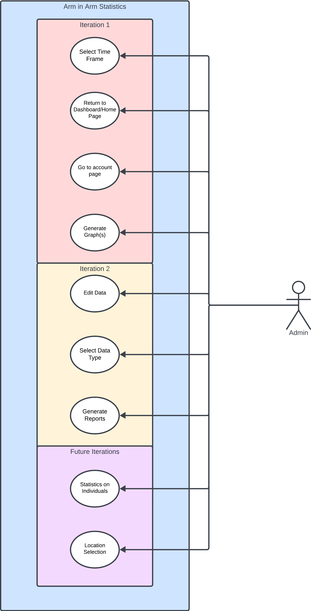

**Description of the problem to be solved.**      
> The problem that we are addressing is that Arm in Arm is having trouble with people having no way to check or confirm their appointment times before their designated appointment.  This is leading to a lot of confusion where people are not showing up to their appropriate appointments and showing up at different times which can lead to a lot of confusion on Arm in Arm’s part.  The confusion makes it harder for Arm in Arm to track who will come on what day, how many times people have come to get food during the week, and how much food each household is getting.  Right now, Arm In Arm just accepts anyone who shows up regardless of if they skipped their appointment or not which can lead to a lot of chaos.  We hope to implement a system that will help this issue.
      
**The objective of the proposed project, to address the problem.**   
>The objective of our project is to create a notification system that will help to solve the confusion that comes from people missing their appointments. Even though it will not be able to stop all people from missing their appointments, this system will hopefully lead to a greater number of people going to their appropriate appointment slots. This will then lead to fewer people missing their appointments, better management of Arm In Arm’s clients, and a better tracking system for how much food a household consumes in a week.  With the new system, Arm In Arm can also be more strict on who gets food at what time because they are now able to tell people in advance that they have an upcoming appointment.
      
**Engaging description of the project, including how and why it will meet this objective.**  
>Our project will consist of implementing an API that runs in the background, and will send messages to clients the day prior to their scheduled appointment with Arm in Arm.  It will meet the objective of the problem because it will allow for an efficient way to make clients more aware of their appointments and let the stakeholders with Arm in Arm have better conficence that their clients will show up for their appropriate appointment times. 
      
**Stakeholders of the project, and explanation of why it is important for the team to be in ongoing contact with them.**  
>The stakeholders of this project are the Arm in Arm staff, and volunteers. It is important to remain in contact with the stakeholders because as the different components of our project continue to be fleshed out, it is essential that our team knows what their expectations are for this project. They may have some intended uses of this system that were not initially expected since our first proposal. To ensure that our project fills all the current problems that they want corrected it will be crucial to remain in contact with these stakeholders. 

**Potential Future Iterations:**  
>Customizable Reminders: Allow clients to set how far in advance they wish to receive reminders
>Rescheduling integration: Send updated appointment confirmations and reminders when an appointment is rescheduled. 
>Notification Reports: Generate reports for Arm in Arm staff on reminder effectiveness (did client attendance increase/decrease from reminders) and client notification preferences. 

[Repository Guidelines: Conduct, Collaboration and Growth](docs/guidelines.md)

**Contributions**  
>We welcome contributions to support the ongoing enhancement and expansion of the project! Explore further details on how to contribute in our [Contribute to Appointment Reminders](docs/contribute.md) section.

# Team 22 - Admin Dashboard
[README.md](docs/Team22:README.md)

[Contibutions and Guidelines](docs/Team22:Contribute.md)


# README: ArmInArm Application
## Contribution & Guidelines Documentation: Opensource Maintenance and Communication
* [Contributions_Guidelines](https://github.com/TCNJ-SE/ArmInArm-Spr24/blob/collab22-prototype3/docs/Contributions_Guidelines.md)
## Code of Conduct
* [Code_Of_Conduct](https://github.com/TCNJ-SE/ArmInArm-Spr24/blob/collab22-prototype3/docs/CodeOfConduct.md)
## Introduction
This project is designed to enhance the efficiency and effectiveness of Arm in Arm, a food distribution pantry. The project aims to help improve Arm in Arm staff members ability to view current client's information and household information, and view and add/edit current pantry location's information. Also, to allow current non-admin users to view their person client and household information as well as view the current pantry locations addresses and hours.

## Problem
The problem we are solving pertains to the overall structure and accessibility of information regarding the client and household lists and the Arm In Arm locations themselves. As it stands, there needs to be an efficient and reliable way for the Arm In Arm staff to access and update client, household and location information.

## Objective
We propose to create functionality that will allow Arm In Arm staff to update client credentials and change information regarding a location's opening/closing times and addresses if necessary. Our objectives include making an easily navigable webpage that displays all desired content in an organized manner.

## Description
The end goal of our application will incorporate improvements to user and admin pages. In the admin dashboard, users will be able to access client, household, and pantry location information. The admin will be able to view and and edit client and household information and pantry location information. They will be able to use different sorting functions to view households based on specific criteria, search for specific data, sort data, download data, and upload data. On the client side, users can only view client, household, and pantry locations' information and cannot edit information. 

## Stakeholders
The primary stakeholders include the Arm In Arm staff/volunteers, the clients who will be creating accounts and utilizing our website, and us as the developers. 

### Importance of continued contact with company
It is important to keep in contact with the company/organization so that we understand what their requirements are. It is not uncommon for requirements to change abruptly, especially if the organization thinks of new ideas that they wish to have implemented. Of course, part of keeping in touch with the company/organization is letting them know what is or isn't feasible given their budget and in our case, our timeframe. Additionally, it is important to inform the company/organization about the development process. Software engineers should be updating their clients on their progress to let them know that work is being done. Without communicating in this aspect, their clients might not be sure whether or not their money is being put to good use.

Our intention is to consistently communicate with Arm In Arm staff every time we update the project significantly. This would let them see and track our progress, allowing them to feel like they are part of the development process.

## Class Diagram


## Use Case Diagram


- Prototype 1: Create basic UI and link it to database
- Prototype 2: Add more sophisticated features to the UI such as filtering results and searching for results, and displaying results
- Prototype 3: Address any bugs encountered in the program and ensure that it is robust before committing as final project
- Final Project: Make UI visibly more pleasing and easier to use
- Future Implementation: Limit number of results per page and allow to navigate multiple pages, Customize columns that are visible, Make working design for multiple devices

# README: ArmInArm Application - Admin Dashboard
## Introduction
This project is designed to enhance the efficiency and effectiveness of Arm in Arm, a food distribution pantry. The project aims to provide a convenient method of accessing attendance data at pantries. Additionally, they will be able to view the quantity of adults who visited a particular site against the quantity of children who visited a particular site. This information is crucial because it can be used to decide which location needs more resources. 
Our team will create an interface for administrators to easily view and generate reports about attendance data. This interface will be accessible via the admin dashboard. This project will allow administrators to access data in one convenient place. This will also nullify the need for users to maintain lengthy spreadsheets.

### [Team 21 Code of Conduct](docs/Team%2021%20-%20Team%20Code.md)
### [Resource for future contributors](Future_Growth.md)
### [User instructions](Instructions.md)


## Ethical, Legal, and Security Concerns

Our project will aid in the real world issues of social, ethical and economic by having statistics and graphs to showcase the impact of ArminArm’s efforts. This in effective will provide ArminArm detailed proof of impact for their stakeholders. 

### Social Issues
The social issue we are addressing is hunger, specifically in Mercer County. Throughout the state (not only Mercer County) families are struggling to provide for themselves and their families due to many factors. The volunteers and staff at Arm In Arm are driven to provide food and care to those who are in need of help. Our job is to aid Arm In Arm so that they can provide for individuals who are suffering from hunger. 

### Ethical Issues
The majority of the ethical issues surround data collection and presentation. There is sensitive information within our databases, including addresses, names, and financial status. It is imperative that we keep this data secure so that no one who is unauthorized to view certain information can access it. If not, it places the clients of Arm In Arm at risk. Another ethical issue could arise from not providing a way to translate our pages into multiple languages. Doing this would ensure that we are not catering to the needs of just one specific demographic of people. Allowing everyone regardless of preferred language to easily access our web pages will ensure that we are implementing ethical practices when developing our software.

### Economic Issues
Economic challenges are perhaps the most influential factor contributing to hunger in Mercer County, and possibly in all of New Jersey. Families are not able to afford healthy food or food at all, so they resort to eating quick meals like fast food or not at all. With many families, there is a degree of stress that comes with trying to pay bills and taxes while also paying for food. Arm In Arm helps alleviate some of this stress by providing food for those who are struggling financially. In developing software to help Arm In Arm, we are indirectly helping families who may be struggling to put food on the table.

### Security & Privacy Concerns
Due to the nature of the information stored in the databases (sensitive information including names, addresses, and financial information) it is important to limit access to authorized users only. This may be accomplished by including checks such as ensuring that the user is signed in and has appropriate permissions. Furthermore, we need to ensure that these values are not able to be modified without the explicit command of a staff member to ensure that the values are not fraudulent.

## Future Scope and Enhancements
In the initial implementation we hope to allow exporting of reports in both csv files and pdfs. In future implementation, we would implement user choice of the format of a report.

## Conclusion
This integrated solution aims to significantly improve the service delivery process at Arm in Arm, benefiting clients, volunteers, and staff through helpful metrics about a pantry's statistics on visits from month to month, year-to-year, or even day to day. 


# ArmInArm-Spr24 Source Code Setup

**The full path to VM source code:** `/home/student4/collab21_work/ArmInArm-Spr24/src`

**Site:** [http://csc415-team21.hpc.tcnj.edu:3000](http://csc415-team21.hpc.tcnj.edu:3000) (adjust port# as needed:xxxx)

## How to Run
**Dir:** `/home/student4/collab21_work/ArmInArm-Spr24/src`

**In terminal:** `rails s --binding=10.18.6.55`

1. Check your IP address:

    ```bash
    ip addr show eth0
    ```

2. Start the Rails server:

    ```bash
    rails s --binding xxx.xxx.xxx.xxx
    ```

## Technology Stack

- **Frontend:** HTML, CSS, JavaScript
- **Backend:** Ruby on Rails
- **Database:** PostgreSQL
- **GitHub:** version control 

### Technology Versions

- Ruby: 3.0.2
- Postgres: `/usr/pgsql-14/bin/postgres`
- HTML: 5

## File Path 

- `/home/student4/collab21_work/ArmInArm-Spr24/src`

## Getting Started

To get started with ArmInArm-Spr24, follow these steps:

1. Clone this repository.
2. Install dependencies using `bundle install`.
3. Set up the database with `rails db:create` and `rails db:migrate`.
4. Start the Rails server with `rails s --binding=10.18.6.55`.

## Install Ruby

You can use the following script to install Ruby:

```bash
./installruby.sh
```

## Use Case Diagram


## System Sequence Diagrams


## State Chart


Potential Future Iterations:
Customizable Reminders: Allow clients to set how far in advance they wish to receive reminders
Rescheduling integration: Send updated appointment confirmations and reminders when an appointment is rescheduled. 
Notification Reports: Generate reports for Arm in Arm staff on reminder effectiveness (did client attendance increase/decrease from reminders) and client notification preferences. 


[Guidelines](docs/guidelines.md)


# README: Client Appointment Scheduling/Check-in System
## Introduction to the Problem
A few ideas have been proposed as to improving the current version of the ArmInArm application, our contribution tackles the issues of  managing guests during serving hours to make the process faster and easier. The objective of this project is to allow clients of the ArmInArm website to Make, Reschedule, and Cancel Appointments. All of this is to essentially give clients the ability to manage their appointments for food pickups on the ArmInArm Website. Another feature we will implement is a page that can be accessed during check ins for their scheduled appointments.

## Collab 22 Implementation
### Household List Admin Page
Admin page that allows admins to view, search, sort, download, & upload data specific household information that is displayed in a table
- Search form: allows to search for specific type of households
- Clear Search Results - clears the page & resets table
- Edit household entry
- View household entry
- Delete household entry
- View members of household
- Sorting feature - allows user to sort table in ascending order based on a specifc data type
- Download feature - allows user to download csv file of table information
- Upload Feature - allows user to upload a csv file of exisiting households
### Client List Admin Page
Admin page that allows admins to view client information that is displayed in a table
- Sorting feature - allows user to sort table in ascending order based on a specifc data type
- Edit client entry
- View client entry
- Delete client entry
## User's My Account Page
Each user will have their own account page that lists their client information, household information, & their unique QR code to their household info
- Allows user to edit client info, but NOT household info (only admins can edit household info)
### Locations Admin Page
- Allowed admin to edit the following information regarding the Arm In Arm pantry locations
    - Location Name
    - Location Address
    - Location Operating Days
    - Location Operating Hours
- Allowed the admin to confirm these changes
- Allowed to delete a location
- Allowed to create a new location
### Locations Client Page
- Allows regular users to view the pantry locations they can visit


## Project Description and Stakeholders
One of the major issues that ArmInArm has has to do with managing people who would like to pick up food during their hours of operation. Sometimes some people would come early, leave, and later return to simply argue that they already had a spot in line. By utilizing the appointments tool, ArmInArm will take out the guesswork of deciding who was supposed to be served first, and simply decide based on the time they had been scheduled for. This had the added benefit of stopping certain hours from being too congested with people picking up food. Major stakeholders involved in the success/failure of the project are the clients that ArmInArm serves, and also the staff who need to use this system to be more organized. For the functionalities that we are implementing it is not too necessary to be in contact with any of the clients/guests who will be making the appointments, but we do need to be in contact with the staff of ArmInArm.

## Social, Ethical, Economic, and Real-World Issues
The success of this project is impacted by a few issues. One is the different demographics. Since people of different cultures will be interacting with the appointment scheduling system, we must assure that the process is not too convoluted so as to not confuse anyone. Some have issues with the language already, so being able to provide a user interface that makes the scheduling process easier is to our advantage.

## Security and Privacy Concerns
A security issue that will need to be addressed is making sure that each user is only able to view their own appointments that have been scheduled. Not only can this be dangerous for the client whose appointment is being viewed, but it could also potentially confuse the one seeing because they may think they have an appointment when they do not.

## Contribute
We encourage contributions to help maintain, improve, and grow the project! 
## Installation and Usage
For instructions to install the project and get started using it.
[Code of Conduct](docs/Team22:CodeOfConduct)


