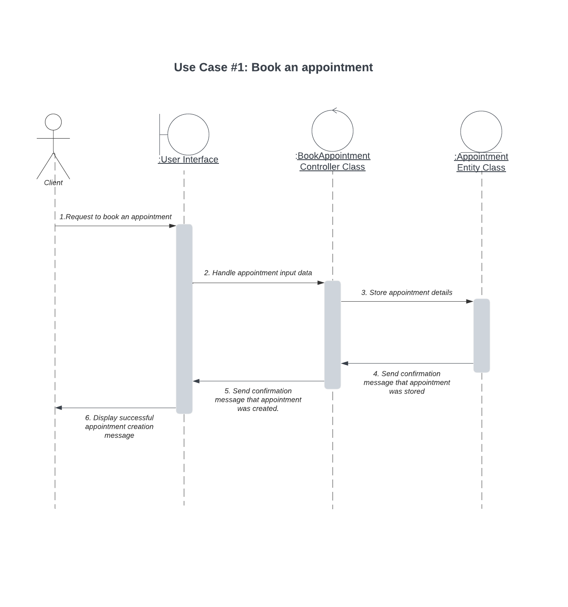
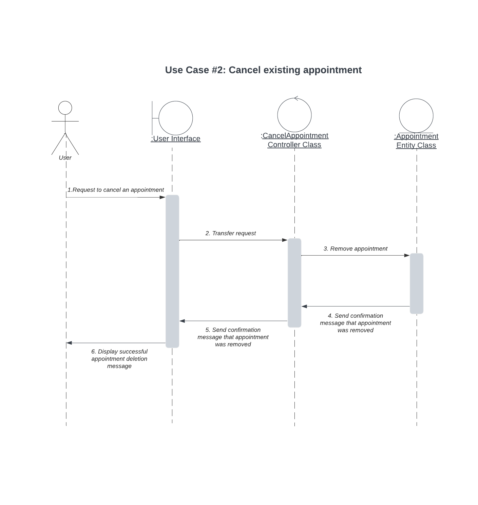
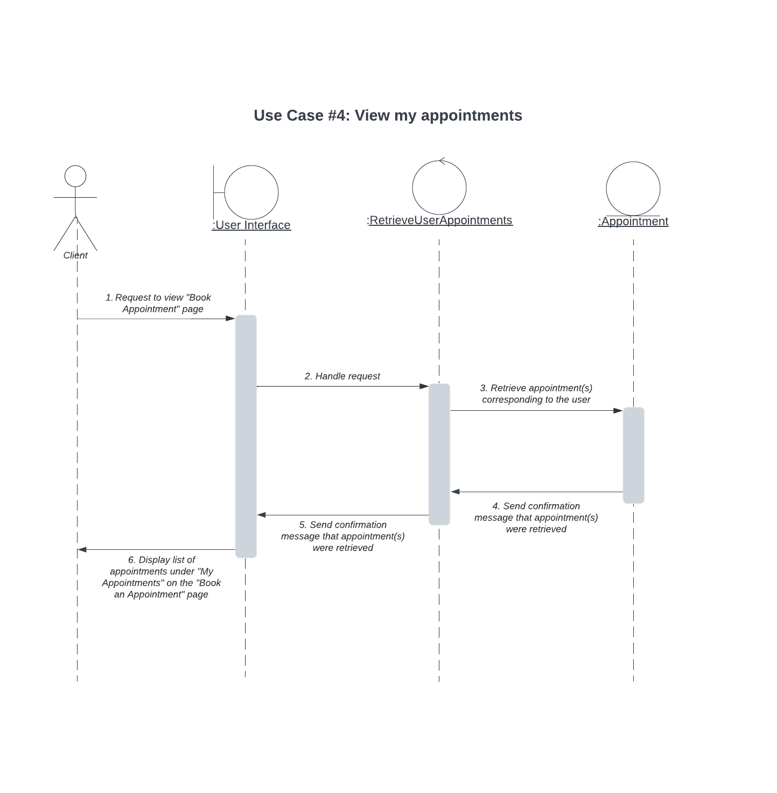
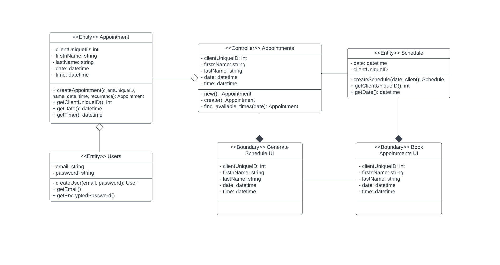
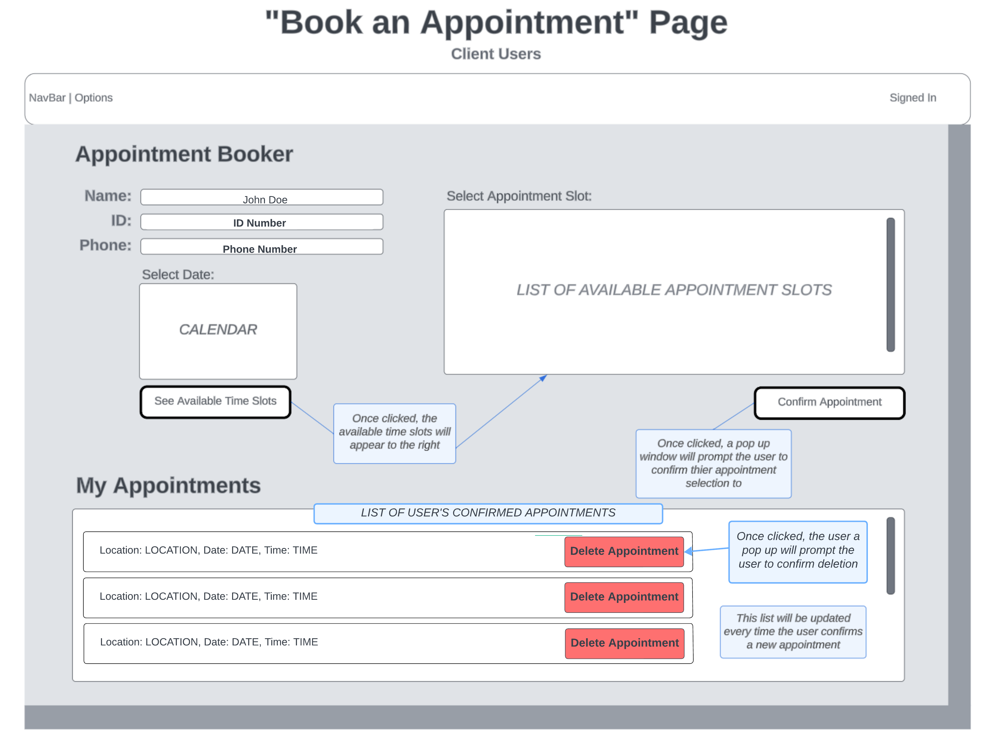

# Appointment Scheduler

CAB Project Team 14

Team: Ifrah Malik, Belmarie Siverio, Joe Petrecca, Dylan Romanski

Development Branch: collab14-dev

**Overview:**

During our visit to Arm in Arm, we noticed long lines that wrapped around the corner, resulting in impatient clients. Our objective is to reduce the wait time for the Arm in Arm clients by providing them with booked appointments to come to the food pantry at their specified time slot. Staff members will ask clients during their registration process if they would like to sign up for a weekly appointment slot, at which point their information will be written down on a report that our software will generate. After the initial registration, the handwritten information will be moved into the software so that the Arm in Arm Staff can run reports and statistics on the information.

Our project is an integral component for the way charitable organizations like Arm in Arm distribute food to those in need. The Appointment Scheduler is designed to alleviate the struggles of both clients and volunteers as they face long lines and higher customer demands. By being able to schedule appointments, a client’s time and dignity is respected. However, it's not just about smaller wait times and greater convenience; the project also adds immense value to the topic by addressing the core issue of efficiency. Arm in Arm volunteers, who are often stretched to their limits during peak distribution hours, will now experience a more manageable workload. Additionally, the system will offer a level of flexibility by allowing staff to adjust appointment windows, manage client number per slot, and accommodate special preferences. 

**Objectives:**

To meet our project objectives we will have to consider that not all clients will switch over to this feature and thus, there will still be a physical line. However, this feature will benefit those who are pre-registered using the appointments feature by shortening the time they need to wait for their supplies. It will also take some load off of the Arm in Arm staff and volunteers by allowing them to pre-plan and ultimately have a shorter line to work with. 

Our project is an innovative idea for Arm in Arm as they currently do not have an appointment system set up that handles the long lines and overcrowdedness. It is a fresh idea that will ultimately make their current system of handing out food bags more efficient. With the ability to schedule clients at specific times of the day, not only will the clients not have to wait around in the lines, but the volunteers will also have a decreased workload and pressure. Additionally, our appointment feature will offer the Arm in Arm staff the flexibility to control how long an appointment window will be, how many clients to take during a certain block of time, and how to handle missed appointments, late clients, and other preferences. Another aspect of our project that makes it innovative is how it will be able to gather important client data for the organization, such as, how many times a client prefers to come to collect bags. When combined with the other group projects, Arm in Arm will gain better insight into their clientele. Lastly, the appointment feature will be scalable to adjust to the needs of the community and the growing number of Arm in Arm clients.

**Social, Ethical, and Economic Issues Addressed**

For the project to deliver value, we must consider social, ethical, economic and real-world issues. For example, some social issues to consider are digital accessibility and privacy concerns. We recognize that not all clients have easy access to the technology required to book an appointment, so we provide the alternative to scheduling appointments with the staff. Additionally, handling client data including personal information and scheduling preferences raises a privacy concern so we must ensure data privacy regulations and educate clients about how their data will be handled. Some ethical concerns include fairness and equity, so we must ensure that clients who are less tech savvy are not at a disadvantage. To address this concern we must make an easy to use interface. Lastly, we must consider the economic and real-world issues that may arise such as cost of management and integration with current operations. We must ensure that the project does not impose additional financial costs and remains free. We must also smoothly integrate our system with pre-existing systems at Arm in Arm by creating thorough documentation for the staff and to help clients adapt to the changes. 

**Feedback from Stakeholders**

The stakeholders have provided valuable feedback for our web application proposal, emphasizing the need for dual capabilities, enabling both Arm in Arm staff members and clients to book appointments, and offering choices for appointment frequency, such as one-time, weekly, and bi-weekly slots. To implement these suggestions, we will develop a dual-interface system, with a staff portal for managing appointments and a client portal for booking. Additionally, we will incorporate appointment frequency options within the booking process, ensuring that clients can choose the recurrence that suits their needs. To address modularity and customization, our system will be fully configurable by Arm & Arm administration, allowing them to set appointment limits and customize preferences. These improvements will enhance the overall user experience and functionality of our application, aligning it more closely with the stakeholders' expectations.

**Ethical and Legal Concerns**

The implementation and use of the proposed appointment scheduling system raise ethical and legal considerations that must be carefully addressed. One key ethical concern is the protection of client privacy and data security. As the system will collect personal information, including demographic, contact, income, and family dynamic details, it is imperative to ensure robust data encryption and access controls. Transparency regarding data usage and obtaining informed consent from clients for notifications and data handling is essential to maintain trust. Furthermore, there is a potential for discrimination if the system's appointment allocation is not managed fairly, potentially being disadvantageous to certain groups of clients. The legal concerns that come into play with the implementation and use of our product revolve around the laws and regulations in place that all Food Banks must adhere to. In turn, we must abide by these regulations such as having handwritten intake forms and documentation of all clients that use Arm in Arm’s resources. 

**Security and Privacy Concerns**

In developing the scheduling software for Arm In Arm, we focus on straightforward security practices that are easy to implement and maintain. We ensure that sensitive data is protected through strong passwords and encryption, and we make certain that only authorized personnel can access client and volunteer information. While we're keeping things simple, these measures provide a solid level of data protection. We're committed to regularly reviewing and updating our security measures to adapt to any potential threats and ensure the safety of Arm In Arm's data and operations.

**Backup and Recovery**

Our scheduling software for Arm In Arm will offer a feature that allows users to generate printables for hard copy backups. This function provides an additional layer of data security and ensures that essential information is accessible even in the absence of digital access. Users will be able to print schedules, client appointment records, and other critical data with ease. These printables will be formatted for clear and concise presentation, making them suitable for record-keeping or sharing with stakeholders who prefer hard copies. Additionally, we will include options to export data in PDF or other common formats to facilitate printing and filing. This feature will not only serve as a backup method but also enhance accessibility and flexibility for Arm In Arm's staff and volunteers in managing their scheduling and client services.

**Team Code**

[Team Guidelines](Team14%20-%20Team%20Code.md)

### Use Case Diagrams
- Use Case 1
  

- Use Case 2
  

- Use Case 3
  
  

### State Diagram

The "Existing Appointments" section displaying the client's booked appointmnets will replace the need for sending an appointment notification. 

### Class Diagram

### UI Mockup

Name and ID no longer need to be entered. Instead, once the user logs in, their name and ID from their profile will be saved and appear on the screen. The appointment they then generate will be linked to their profile.

The functionality of generating a schedule will be part of Team 21's admin panel. 
