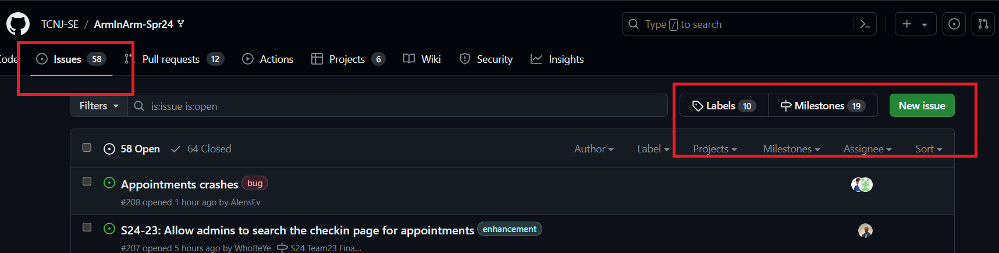
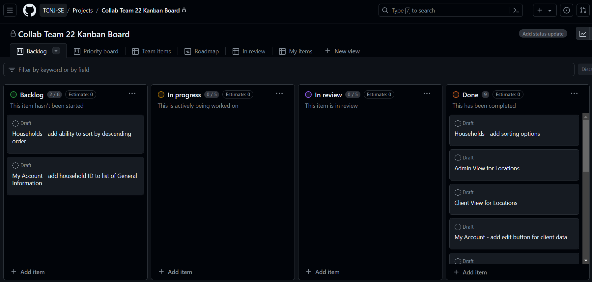
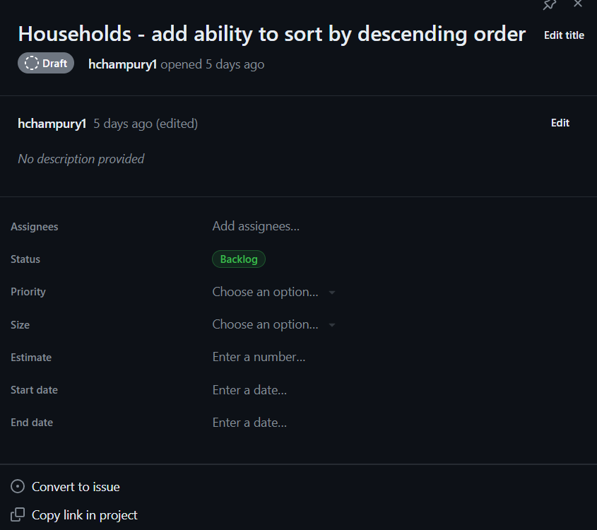
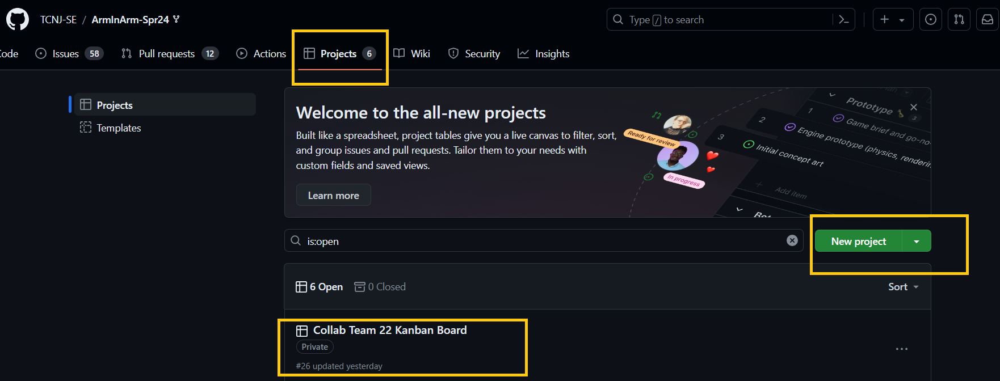
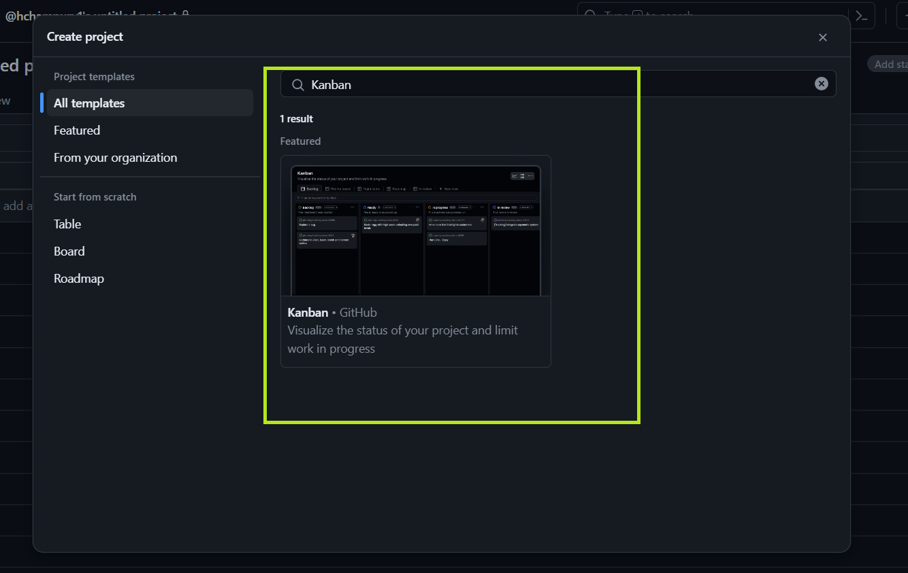
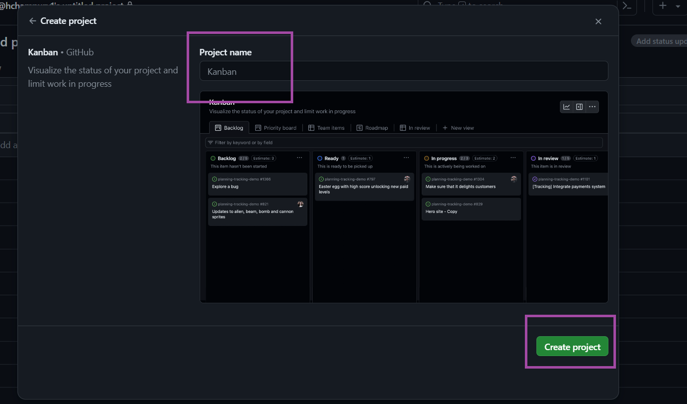
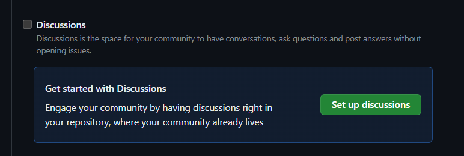

# Opensource Maintenance and Communication	
## Guidlines & Processes for Project
### Where will community member discuss and organize issues & bugs
- Github "Issues": tab at the top of the Github repository used to report bugs, request features, ask questions allowing contributors to find issues easily and work on them
  - Issues Categories: bug reports, feature requests, documentation improvements
  - Labels: can create to tell contributors the type of issue (bug, enhancement, documentation)
  - Milestones: provide description of milestone, categorize & prioritize issues, assign task to contributors, & add due dates
  

### How to keep track of progress of work?
- Kanban Board - used to help visualize work & what tasks haven't been started, are in-progrss, in review, & are completed

    - Tasks can be assigned to specific team members
    - Can set priority, status, start date, end date, etc. of each task

#### Creating a Kanban Board
1. Click on "Projects" tab
2. Click "New Project"

3. Search for "Kanban"
4. Click on "Kanban" template

5. Enter project name
6. Click "Create Project"

7. Access Kanban Board in Projects displayed in first image
### Where will they discuss future plans?
- Chat Channels: use Slack or Discord to discuss current work, future plans & ideas
- Github Discussion: contributors can engage in longer-form discussions on specific topics in the project
  - Go to "Settings", scroll down to "Discussions", & click "Set up discussions"

- In person meetings: members can discuss current work, future plans & ideas
### Process for Contributor to Contribute Code to Project
- Documentation - CONTRIBUTING.md file that outlines guidelines for contributing to the project - info on setting up development environment, coding standards, test procedures, & contribution process
- Code of Conduct created that contributors are expect to adhere to
- Fork & Pull requests - contributor can fork repository, create a branch, making changes, and submit pull request to main repository
### Guidelines for Accepted Code
- Pull requests undergo review by other project members before merging to ensure code quality, correctness, and to make sure it follows the project standard,
- Other member can provide feedback & suggestions for improvement
- Can merge once pull request is approved
  - may need a certain amount of approvals before allowed to merge