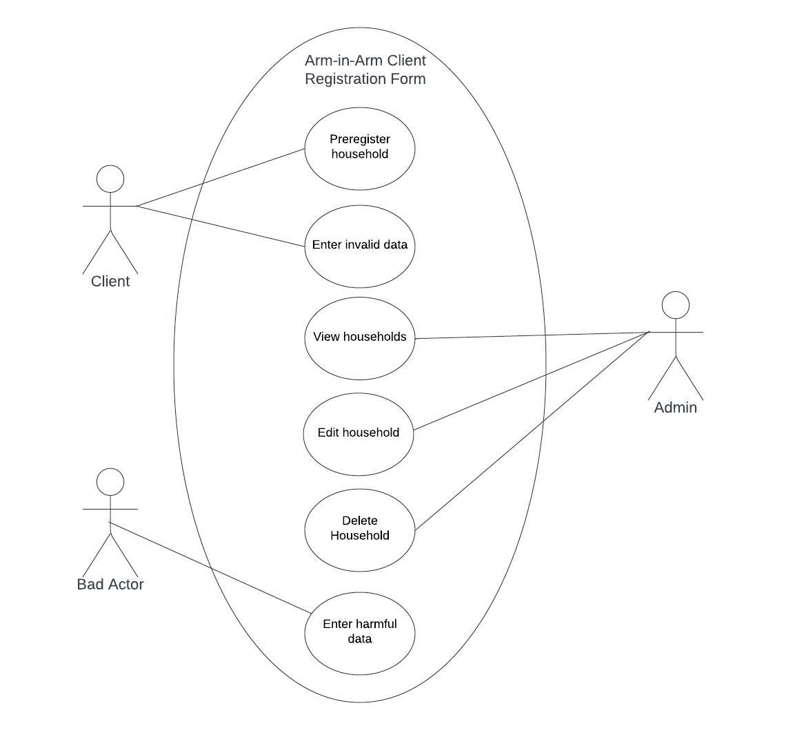

# README: ArmInArm Application

## Introduction
This project is designed to enhance the efficiency and effectiveness of Arm in Arm, a food distribution pantry. The project aims to streamline client service, lessen wait times, better volunteer coordination, and improve overall management through an integrated system comprising appointment scheduling, pre-registration, and volunteer assignment. Clients can schedule, view, and cancel appointments for food pickup. Admin dashboard for appointment management and user feedback review. Estimated wait times displayed based on Arm in Arm's data and pre-registered users. Pre-registration Module & QR Code Generation:

## Ethical, Legal, and Security Concerns

Implementing measures like two-factor identification for security. Legal compliance with food bank regulations and data protection laws.
Regular security reviews and updates. Backup and Recovery The system will include functionalities for generating printable backups and exporting data in common formats, ensuring data security and accessibility.

## Future Scope and Enhancements
While the initial implementation focuses on core functionalities, future versions can expand to implementing a language change bar to accommodate for different user preferences.

## Conclusion
This integrated solution aims to significantly improve the service delivery process at Arm in Arm, benefiting clients, volunteers, and staff through streamlined scheduling, pre-registration, and volunteer coordination. The project's success hinges on effective implementation, regular updates, and a strong focus on user accessibility and security.

## Team 11

### Prototype 3
This prototype implemented the admin panel for form review.  Further steps to complete the final implementation include bug fixes, adding a search feature, and bulk actions.

[Contribution Guidelines](/docs/Team11Docs/contribution_guidelines.md)

[Team Code](</Team 11 - Team Code.md>)

[Installation and Usage](/team11_installation_usage.md)

### Prototype 2 - Design Documents and Changes
[Prototype 2 README.md](/team11_prototype2.md)

### Prototype 1 - Introduction, Background Information, and Use Case
[Prototype 1 README.md](/team11_prototype1.md)

# Arm In Arm System Enhancement Project
## Team 13

### Diagrams 
#### [Team13:use case](https://github.com/TCNJ-SE/ArmInArm-Spr24/blob/collab13-prototype2/docs/Group13%20UML%20Diagrams%20-%20use%20case%20.png)

#### [Team13:SSD](https://github.com/TCNJ-SE/ArmInArm-Spr24/blob/collab13-prototype2/docs/Group13%20UML%20Diagrams%20-%20SSD.png)

#### [Team13:detailed design class diagram](https://github.com/TCNJ-SE/ArmInArm-Spr24/blob/collab13-prototype2/docs/Group13%20UML%20Diagrams%20-%20Detailed%20Class%20Diagram.png)

#### [Team13:State charts ](https://github.com/TCNJ-SE/ArmInArm-Spr24/blob/collab13-prototype2/docs/Group13%20UML%20Diagrams%20-%20StateChart.png)

#### [Team13:Use case description ](https://github.com/TCNJ-SE/ArmInArm-Spr24/blob/6340b05f466d6dcf185d40f3dd1906b044bc0a0a/docs/Group%2013%20-%20use%20case%20descriptions%20.pdf)

### Team Code
#### [Team13:team code](https://github.com/TCNJ-SE/ArmInArm-Spr24/blob/collab13-prototype3/team13-teamcode.md)

### [Project contribution guidelines -team 13](https://github.com/TCNJ-SE/ArmInArm-Spr24/blob/collab13-final/docs/Project%20contribution%20guidelines-team13.md)

#### [Installation and usage -team 13](https://github.com/TCNJ-SE/ArmInArm-Spr24/blob/collab13-final/docs/installation%20%26%20usage-team13.md)
### Description of Problem
Arm In Arm is focused on bringing together the community by aiding those in need with food and shelter. The challenge is to provide an efficient and user-friendly application to assist both staff and clients in this vital work.

### Project Objective
Our project aims to enhance the registration process by:
- Preventing duplicate registrations for individuals.
- Enabling family members at the same address to register together.
These improvements will streamline service delivery and improve data accuracy for reporting to government programs.

### Project Description
We aim to equip Arm In Arm with a more efficient and user-friendly system that allows them to serve the community more effectively. By improving the registration process to avoid duplicates and facilitating family registrations, the organization can provide quicker services and maintain better data records—key for areas where many do not qualify for government benefits.

### Stakeholders and Communication
Stakeholders:
- Arm In Arm staff
- State and federal government bodies
- Communities served by Arm In Arm
- TCNJ CSC415 students

**Communication Strategy:**
It's crucial to maintain ongoing communication with Arm In Arm to ensure the system meets their needs. Regular collaboration with CSC415 students is vital to align our efforts within the project. Engaging with the community helps us understand and address their specific needs. While direct communication with funding government agencies is managed through Arm In Arm, their inputs are essential for our data strategy.

### Considerations and Impact
**Social and Ethical:**
We are committed to managing user data responsibly—upholding privacy and adhering to all applicable regulations.

**Economic and Real-World:**
The project goes beyond immediate aid; it addresses underlying issues like poverty and inequality through community engagement, education, and partnerships with local governments. These efforts aim to create sustainable improvements in the lives of those served.

### Features
- **User Registration Verification:** Prevents duplicate registrations and ensures each individual or family is uniquely and accurately registered.
- **House address verification:** check for similar addresses during registration to avoid duplication. 

### Getting Started
To register, simply follow the prompts on the registration page by logging in and pre registering. The system will guide you through entering your information and verify that you or your family members have not registered previously.

### Conclusion
This project is designed not only to enhance operational efficiency but also to significantly impact the community by supporting Arm In Arm in their mission. Through meticulous planning and ethical data management, we are dedicated to delivering a valuable and lasting tool for the organization and its clients.

## Project Name: Group 12 - Arm in Arm 

## Description of the problem to be solved.
The current version of Arm in Arm’s client registration form does not validate input. This needs to be improved as it can not only lead to inaccurate or invalid data entries but might also leave Arm in Arm’s database vulnerable to injection attacks.

## The objective of the proposed project, to address the problem.
The accuracy validation implemented should be able to handle user input that does not reflect the targeted data. For example, if an integer is required for the number of adults, the input field should not accept a string value. The accuracy validation must request the user to recheck their entry and make sure it aligns with the proper format. 

## Engaging description of the project, including how and why it will meet this objective.
The project will provide input validation for all entries of the client registration form, notifying the user if an invalid entry is present so a new value can be entered prior to form submission. By ensuring type consistency and detecting potentially harmful data, the project aims to enhance the integrity and security of the registration process. 

## Stakeholders of the project, and explanation of why it is important for the team to be in ongoing contact with them.
The stakeholders of the project are the staff at ArmInArm, residents in Mercer County utilizing the service/clients, and software developers for the ArmInArm web application. It’s important to be in contact with Arm in Arm staff to make sure the project meets their requirements, and with other software developers working on the application to ensure the application remains cohesive. The Arm in Arm staff have contact with residents using the application and can inform the team whether the application is meeting their needs.

## Discussion of the social, ethical, economic and real-world issues that must be addressed for the project to deliver value, and how the team will do this.
Multiple issues need to be addressed to deliver value to the project. The first issue is the lack of input validation can lead to the collection of inaccurate or inappropriate data. Without proper validation, the system is susceptible to injection attacks, which could compromise the security of the database. Additionally, the ethical handling and confidentiality of user data are paramount to maintain trust and comply with privacy laws. To address these issues, socially, the project ensures inclusivity, providing an interface that is accessible to clients of all demographics, including those with disabilities. It also respects client privacy by securely handling personal data. The team would address this by adhering to web accessibility standards and implementing rigorous data protection protocols. Ethically, the project faces the responsibility of ensuring that data is not only secure but also used responsibly. The team would establish ethical guidelines and regular audits to ensure compliance with these standards. Economically, the project aims to deliver value while remaining cost-effective. It does not impose a significant financial burden on Arm In Arm or its clients. The team would also implement scalable solutions to manage costs effectively. In terms of real-world issues, the project is reliable and performs well under a variety of conditions, providing uninterrupted service to clients. It also needs to be scalable to accommodate a growing number of users without degradation in performance. To address this, the team would employ robust testing methodologies and prepare a system that can be scaled when needed. Ultimately, to deliver real value to this project, the team would maintain regular communication with the stakeholders to understand their needs and preferences.                                                 

## Descriptive analysis of security and privacy concerns, and how you will address these.
It is important to check for the accuracy of the form entries because they will be inputted into the database. If the input is not checked, the database could be vulnerable to SQL injection attacks. Since this database is directly dealing with clients’ personal and financial information, their data must be protected and entrusted with Arm In Arm. To avoid these types of breaches, only valid data types and entries will be accepted before the form is added to the database. 

## Team 12 Code 
[Team 12 Code](https://github.com/TCNJ-SE/ArmInArm-Spr24/blob/collab12-prototype3/docs/Team%2012%20-%20Team%20Code.md)

## Project Contribution Guidelines
[Project Contribution Guidelines](https://github.com/TCNJ-SE/ArmInArm-Spr24/blob/collab12-prototype3/docs/Project%20Contribution%20Guidelines.md)

## Installation and Usage
[Installation and Usage](https://github.com/TCNJ-SE/ArmInArm-Spr24/blob/collab12-prototype3/docs/Installation_and_Usage.md) 

## Use case diagram

## Design Class Diagram

## System Sequence Diagram

## Statechart
 

## UI

- Prototype 1:
  - Basic error handling for some fields
- Prototype 2:
  - We validated the data input for all fields in the registration form. When users enter incorrect data in the fields, the error messages are displayed at the top of the page.
  - We added dropdown menus for State and County fields and modified the date of birth dropdown menu to ensure users born before 2019 can register.
  - We also added a new field called “Preferred Pantry Location” with a dropdown menu.
  - We provided checks to ensure all registrants are at least 18 and that no more than 7 members are added to a household.
  - Known Bug: In some instances, such as switching tabs on the navigation bar during registering and then trying to complete the form, the county dropdown does not appear. This is currently fixed by refreshing the page.

## Team 14 implementation:

### Guidelines for the Team
- [Link to Guidelines](/docs/Team%2014%20-%20Team%20Code.md)

### Installing the Application
- [Link to Installation Document](/docs/team14-installation.md)

[Contributing](/docs/Team%2014:%20Contribute.md)

### UML
- [Use Case Diagram](/docs/Team%2014:%20Use%20Case%20Diagram.png)
- [Use Case Description](/docs/Team%2014:%20Use%20Case%20Description.md)
- [Design Class Diagram](/docs/Team%2014%20Class%20Diagram.png)
- [System Sequence Diagram](/docs/Team%2014:%20SSD.png)
- [Statechart](/docs/Team%2014%20Statechart.png)

### Description and Intent

Team 14's implementation involves the inclusion of language support for English, Spanish, and Haitian Creole. This inclusion allows accessibility of the registration form to more of Arm and Arm's clientele, and is implemented using a new language table in the existing PostGreSQL database.

- Prototype 3:
  - Finalize all fields and UI
  - Do error handling and include error messages for new household members 
- Future Directions: 
  - Add an admin review feature that allows the admin to modify/review the registration forms. 
  - Add an approval button and a decline button where the admin can approve/decline all the registration forms. If the admin chooses to decline the registration form, a textbox feature will be implemented to enter a declination reason. 

